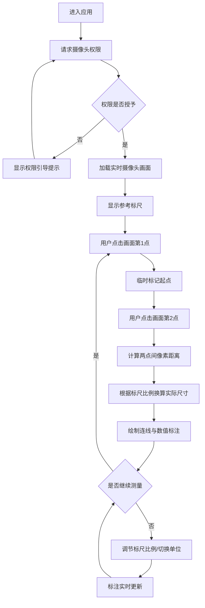

## 1. 产品概述

视觉测算 AI 是一款基于实时摄像头画面的空间距离测量工具，通过点击画面中任意两点快速测算空间相对距离，为用户提供直观、高效的实景尺寸标注体验。
- 面向家装设计、工程勘测、室内测量、日常测距等场景的专业人员与普通用户
- 核心价值：替代传统卷尺测量，实现非接触式、可视化的实时空间尺寸测算

## 2. 核心功能

### 2.1 功能模块
1. **测量主界面**：摄像头实时预览、测量交互面板、标注图层显示
2. **测量操作模块**：两点点击测距、多组点位标记、数值标注显示
3. **参数调节模块**：厘米/米单位切换、参考标尺比例滑块调节
4. **图层管理模块**：多组尺寸标注图层、清除/删除标注

### 2.2 页面详情
| 页面名称 | 模块名称 | 功能描述 |
|---------|---------|---------|
| 测量主页面 | 摄像头预览区 | 全屏实时摄像头画面、画面中央参考标尺、点击交互区域 |
| 测量主页面 | 顶部状态栏 | 摄像头状态指示、当前单位显示、当前标尺比例显示 |
| 测量主页面 | 测量操作面板 | 开始测量按钮、清除当前标注按钮、清空全部按钮 |
| 测量主页面 | 底部控制面板 | 单位切换开关（cm/m）、标尺比例滑块、标注图层列表 |

## 3. 核心流程

用户打开应用后授权摄像头权限，实时画面加载完成后即可开始测量。点击画面中第一个点作为起点，再点击第二个点作为终点，系统自动计算并标注两点间的距离。可重复操作生成多组测量标注，通过滑块调节参考标尺比例以校准测量精度，支持随时切换单位显示。

## 4. 用户界面设计

### 4.1 设计风格
- **主色调**：深空黑 (#0A0E1A) 背景 + 电光青 (#00F5D4) 高亮标注 + 警示橙 (#FF6B35) 交互重点
- **辅助色**：半透明玻璃质感面板、荧光绿测量标记、白色文字
- **按钮风格**：圆角玻璃拟态按钮、悬停发光效果、按压微缩动画
- **字体**：使用 Orbitron 作为数字显示字体（科技感），Noto Sans SC 作为中文界面字体
- **布局风格**：全屏沉浸式摄像头画面、悬浮式控制面板、边缘吸附工具条
- **视觉元素**：扫描线动效、网格参考线、测量点脉冲动画、标注渐变连接线

### 4.2 页面设计概览
| 页面名称 | 模块名称 | UI 元素 |
|---------|---------|---------|
| 测量主页面 | 摄像头预览区 | 全屏 video 元素 + 覆盖 canvas 标注层 + 半透明中央参考标尺 |
| 测量主页面 | 顶部状态栏 | 左侧摄像头状态指示灯、中间标题「视觉测算 AI」、右侧当前单位与比例显示 |
| 测量主页面 | 测量操作面板 | 悬浮右下：清除单点（橙色）、清空全部（红色渐变边框） |
| 测量主页面 | 底部控制面板 | 毛玻璃抽屉式面板：单位切换 (Segmented Control)、标尺比例滑块 (带刻度)、标注列表 (可滚动) |
| 测量主页面 | 标注图层 | 荧光绿圆点标记 + 虚线连接线 + 半透明黑底白字数值标签 + 箭头指示 |

### 4.3 响应式设计
- **桌面端优先**：控制面板横向排布于底部，操作按钮悬浮于右下
- **平板适配**：底部面板采用分段布局，按钮大小适配触控
- **移动端**：底部面板改为抽屉式上滑，操作按钮位置优化为拇指热区
- **触控优化**：所有交互元素最小 44px 触控区域，滑动滑块支持粗手操作

### 4.4 动效与微交互
- 画面加载：渐变淡入 + 扫描线从上至下扫过
- 点击标记点：脉冲扩散环动画 + 轻微放大反馈
- 连线绘制：从起点到终点的生长动画
- 数值显示：向上滑入 + 淡入效果
- 面板展开/收起：弹性过渡动画
- 单位切换：数字滚动过渡效果
