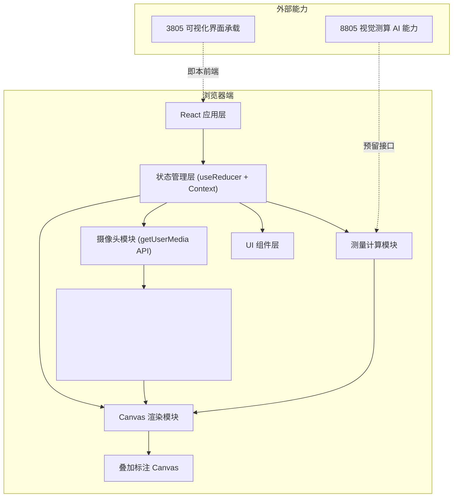

## 1. 架构设计

本项目为纯前端单页应用，无需后端服务，所有功能基于浏览器 Web API 实现。摄像头画面实时渲染至 Canvas 进行标注叠加，测量计算逻辑在客户端完成，全程无任何数据上传或文件缓存。



## 2. 技术选型

- **前端框架**：React@18 + TypeScript@5 + Vite@5
- **样式方案**：TailwindCSS@3 + CSS Modules（动效细节）
- **状态管理**：React Context + useReducer（轻量级状态）
- **摄像头**：MediaDevices.getUserMedia API
- **图形绘制**：HTML5 Canvas 2D API（双图层：参考层 + 标注层）
- **动画库**：Framer Motion（面板动效、过渡）
- **无后端、无数据库、无第三方存储服务**

## 3. 目录结构与路由定义

| 路径 | 用途 |
|-----|------|
| `/` | 测量主界面（唯一页面） |

```
src/
├── components/
│   ├── CameraPreview.tsx      # 摄像头预览组件
│   ├── MeasurementCanvas.tsx  # 标注 Canvas 组件
│   ├── TopStatusBar.tsx       # 顶部状态栏
│   ├── ControlPanel.tsx       # 底部控制面板
│   ├── ActionButtons.tsx      # 悬浮操作按钮
│   ├── AnnotationList.tsx     # 标注列表
│   ├── ScaleRuler.tsx         # 参考标尺组件
│   └── UnitSwitch.tsx         # 单位切换组件
├── hooks/
│   ├── useCamera.ts           # 摄像头调用 Hook
│   ├── useMeasurement.ts      # 测量逻辑 Hook
│   └── useCanvasRenderer.ts   # Canvas 渲染 Hook
├── store/
│   └── measurementStore.tsx   # 全局状态 Context
├── types/
│   └── index.ts               # TypeScript 类型定义
├── utils/
│   ├── distanceCalc.ts        # 距离计算工具
│   └── canvasDrawing.ts       # Canvas 绘制工具函数
├── App.tsx
├── main.tsx
└── index.css
```

## 4. 数据模型与状态定义

### 4.1 核心类型定义

```typescript
// 测量点坐标
interface MeasurePoint {
  id: string;
  x: number;           // Canvas 坐标系 X (相对百分比 0-1)
  y: number;           // Canvas 坐标系 Y (相对百分比 0-1)
  timestamp: number;
}

// 单组测量标注
interface Measurement {
  id: string;
  pointA: MeasurePoint;
  pointB: MeasurePoint;
  pixelDistance: number;    // 像素距离
  realDistance: number;     // 实际距离（单位：厘米）
  unit: 'cm' | 'm';
  createdAt: number;
  label?: string;           // 可选标注名称
}

// 标尺比例（校准参数）
interface ScaleConfig {
  pixelsPerCm: number;      // 每厘米对应像素数
  referenceLengthCm: number;// 参考物长度（默认 10cm 标尺）
}

// 全局应用状态
interface AppState {
  cameraStatus: 'idle' | 'requesting' | 'active' | 'error';
  cameraError: string | null;
  pendingPoint: MeasurePoint | null;   // 待配对的第一个点
  measurements: Measurement[];
  currentUnit: 'cm' | 'm';
  scaleConfig: ScaleConfig;
  isPanelExpanded: boolean;
  selectedMeasurementId: string | null;
}
```

## 5. 核心算法说明

### 5.1 距离计算流程

1. **坐标标准化**：将点击坐标转换为相对视频画面的百分比坐标 (0~1)，确保窗口缩放后标注位置不变
2. **像素距离计算**：使用欧几里得距离公式：`distance = √[(x2-x1)² + (y2-y1)²]`
3. **实际尺寸换算**：`realDistance(cm) = pixelDistance / pixelsPerCm`
4. **单位转换**：米模式下 `realDistance(m) = realDistance(cm) / 100`

### 5.2 标尺比例校准

- 滑块取值范围：pixelsPerCm ∈ [5, 200]（默认 50 px/cm）
- 滑块调节实时更新所有已存在测量的 `realDistance` 数值
- 参考标尺组件绘制一条长度对应 `referenceLengthCm` 的可视化刻度条

## 6. Canvas 渲染策略

采用双 Canvas 叠加方案：
- **底层 Canvas（参考层）**：绘制参考标尺、网格辅助线，仅在比例变化或尺寸变化时重绘
- **顶层 Canvas（交互层）**：绘制测量点、连接线、数值标签，每次状态变化或鼠标移动时重绘

### 渲染循环
- 实时测量预览（鼠标移动时绘制待完成连线）：使用 `requestAnimationFrame` + 脏检查
- 静态标注渲染：状态变更触发重绘

## 7. 安全与隐私约束

- **不缓存画面**：video 元素仅作实时预览，绝不调用 `canvas.toDataURL()` 或任何截图 API
- **无存储**：不使用 localStorage、IndexedDB、Cookie 存储任何数据，刷新页面即清空所有测量
- **无导出**：不提供下载、分享、上传等任何文件输出功能
- **摄像头权限**：仅在用户主动点击开始时请求，组件卸载时主动调用 `MediaStreamTrack.stop()` 关闭摄像头
